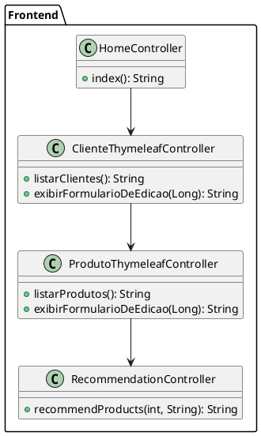

# Argos AI

**Argos AI** é uma aplicação web de recomendação e gerenciamento de produtos, desenvolvida em **Java** com **Spring Boot**. O projeto utiliza **Inteligência Artificial** via **OpenAI API** para recomendar produtos personalizados aos usuários, baseado em informações como idade e gênero, fornecendo uma experiência única e direcionada. Além disso, o sistema conta com funcionalidades de CRUD, autenticação, envio de mensagens e envio de emails, utilizando tecnologias modernas e boas práticas de segurança.

## 🚀 Visão Geral do Projeto

O sistema **ArgosAI-Sprint3** possui as seguintes funcionalidades principais:

- **Recomendação de Produtos com IA**: Recomendações personalizadas com base no perfil do usuário.
- **Gerenciamento de Clientes e Produtos**: CRUD para clientes e produtos, permitindo adicionar, atualizar, listar e excluir.
- **Autenticação e Autorização**: Implementação de segurança usando **Spring Security** com controle de acesso.
- **Envio de Mensagens e E-mails**: Envio de e-mails com o serviço de **Gmail** e utilização do **RabbitMQ** para filas de mensagens.
- **Internacionalização**: Suporte multilíngue com tradução dinâmica entre português (pt-BR) e inglês (en-US).

A aplicação é totalmente conteinerizada com **Docker** e foi implantada no **Fly.io** para garantir disponibilidade e escalabilidade.

## 🌐 Acessar a Aplicação

[Link para a aplicação no Fly.io](https://argosia.fly.dev)

## 📊 Estrutura do Projeto

A arquitetura do projeto segue o padrão **MVC (Model-View-Controller)** com a seguinte divisão de camadas:

- **Controller**: Gerencia as requisições HTTP e define os endpoints da API.
- **Service**: Contém a lógica de negócio.
- **Repository**: Gerencia a persistência de dados com o banco de dados Oracle.
- **Model**: Representa as entidades da base de dados.

### Principais Tecnologias e Bibliotecas Utilizadas

- **Java 17**: Linguagem de programação para desenvolvimento da aplicação.
- **Spring Boot 3.0**: Framework para simplificação do desenvolvimento.
- **Spring Security**: Controle de autenticação e autorização.
- **Spring Data JPA**: Manipulação de dados com ORM.
- **Thymeleaf**: Template engine para renderização das páginas.
- **Swagger (OpenAPI)**: Documentação interativa da API.
- **Docker**: Conteinerização da aplicação.
- **Fly.io**: Plataforma de deploy em nuvem.
- **RabbitMQ**: Broker de mensagens para comunicação assíncrona.
- **JUnit**: Framework para testes unitários.

### Destaque para Inteligência Artificial com OpenAI API

A aplicação utiliza **OpenAI API** para fornecer recomendações personalizadas de produtos. Através de um endpoint de recomendação, a aplicação se comunica com a OpenAI para gerar sugestões baseadas em dados fornecidos pelo usuário, como idade e gênero. Essa integração permite um alto nível de personalização, criando uma experiência dinâmica e diferenciada.

**Exemplo de Requisição OpenAI**:
```java
OkHttpClient client = new OkHttpClient();
String prompt = "Sugira produtos para uma pessoa de sexo " + sexo + " e com " + age + " anos de idade...";
JSONObject json = new JSONObject();
json.put("model", "gpt-3.5-turbo");
json.put("messages", new JSONArray().put(new JSONObject().put("role", "user").put("content", prompt)));

Request request = new Request.Builder()
        .url(OPENAI_API_URL)
        .header("Authorization", "Bearer " + apiKey)
        .post(RequestBody.create(json.toString(), MediaType.get("application/json; charset=utf-8")))
        .build();
```

## 🌐 Endpoints da API

### Endpoints Principais

| Método | Endpoint                  | Descrição                                 |
|--------|----------------------------|-------------------------------------------|
| GET    | /api/produtos              | Lista todos os produtos                   |
| POST   | /api/produtos              | Cria um novo produto                      |
| GET    | /api/clientes              | Lista todos os clientes                   |
| GET    | /recommendations           | Recomendação de produtos via OpenAI       |
| GET    | /contact                   | Formulário de contato                     |
| POST   | /contact/sendMessage       | Envio de mensagem via e-mail              |

### Recomendação de Produtos

```json
GET /recommendations?age=25&sexo=feminino
{
    "name": "Perfume Paris",
    "description": "Perfume leve e floral, ideal para uso diário.",
    "price": 250.00,
    "image": "https://example.com/perfume.jpg"
}
```

## 🛠️ Arquivo `application.properties` e Configurações de Segurança

No arquivo `application.properties`, as credenciais e senhas sensíveis são armazenadas em variáveis de ambiente no GitHub Secrets e referenciadas no `main.yml` para garantir a segurança. Algumas das principais configurações incluem:

```properties
spring.datasource.url=jdbc:oracle:thin:@//oracle.fiap.com.br:1521/orcl
spring.datasource.username=${ORACLE_DB_USER}
spring.datasource.password=${ORACLE_DB_PASSWORD}
spring.mail.username=${GMAIL_USER}
spring.mail.password=${GMAIL_PASSWORD}
openai.api.key=${OPENAI_API_KEY}
```

## 🔐 Autenticação e Segurança

### Configuração do Spring Security

A aplicação utiliza **Spring Security** para autenticação e controle de acesso. As rotas são protegidas, garantindo que apenas usuários autenticados possam acessar o sistema.

```java
http
    .csrf().disable()
    .authorizeHttpRequests()
    .requestMatchers("/register", "/login", "/css/**").permitAll()
    .anyRequest().authenticated()
    .and()
    .formLogin()
    .loginPage("/login")
    .defaultSuccessUrl("/index", true)
    .permitAll();
```

## 🌎 Internacionalização

A aplicação é internacionalizada para suportar múltiplos idiomas, principalmente português (pt-BR) e inglês (en-US). Para trocar o idioma, basta adicionar o parâmetro `lang` na URL:

- Exemplo: `/clientes/listar?lang=en` para exibir a interface em inglês.

## 🐳 Deploy com Docker e Fly.io

O projeto é completamente conteinerizado com Docker e configurado para deployment no Fly.io, utilizando o arquivo `fly.toml` para configurações adicionais:

### Arquivo `Dockerfile`

```dockerfile
# Etapa 1: Compilar o projeto
FROM maven:3.8.8-eclipse-temurin-17 AS build
WORKDIR /app
COPY pom.xml .
COPY src ./src
RUN mvn clean package -DskipTests

# Etapa 2: Executar a aplicação
FROM eclipse-temurin:17-jdk-jammy
WORKDIR /app
COPY --from=build /app/target/ArgosAI-Sprint3-0.0.1-SNAPSHOT.jar app.jar
EXPOSE 8080
ENTRYPOINT ["java", "-jar", "app.jar"]
```

### Configuração no `fly.toml`

```toml
app = 'argosia'
primary_region = 'gig'
[http_service]
  internal_port = 8080
  force_https = true
  auto_start_machines = true
  min_machines_running = 0
```

## 💡 Testes Unitários com JUnit

A aplicação utiliza **JUnit** para testes unitários. Com a inclusão de bibliotecas como **Mockito** e **MockWebServer**, foram realizados testes para validar a funcionalidade e a segurança da aplicação.

## 📐 Diagramas UML

### Diagrama UML - Backend


### Diagrama UML - Frontend



## 📜 Dependências e Bibliotecas Utilizadas

### Spring Boot
...
